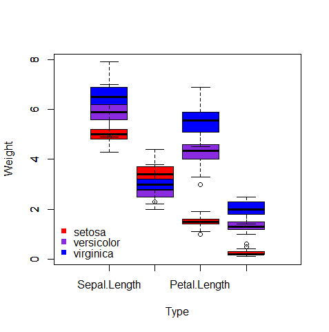
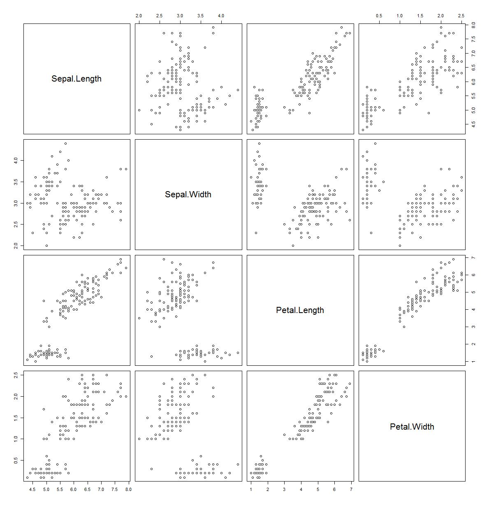
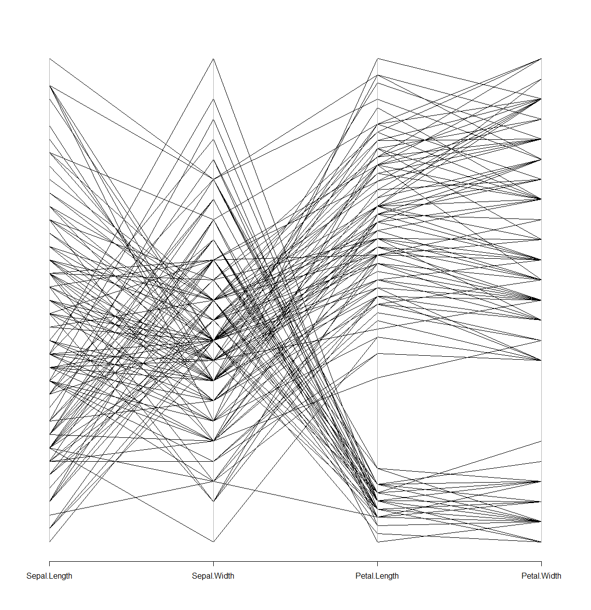
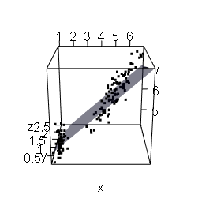
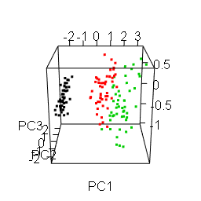

# R cheatsheet (プロット編)

## 目次

* 1. [グラフの種類を自動的に選択して作図](#グラフの種類を自動的に選択して作図)
* 2. [値域・定義域の最大値・最小値](#値域・定義域の最大値・最小値)
* 3. [プロットの種類](#プロットの種類)
	* 3.1. [軸のみ](#軸のみ)
	* 3.2. [点のみ](#点のみ)
	* 3.3. [途切れた折れ線](#途切れた折れ線)
	* 3.4. [折れ線](#折れ線)
	* 3.5. [x軸への垂線](#x軸への垂線)
	* 3.6. [階段状プロット(左)](#階段状プロット(左))
	* 3.7. [階段状プロット(右)](#階段状プロット(右))
	* 3.8. [c+p](#c+p)
	* 3.9. [l+p](#l+p)
* 4. [数学関数から作図](#数学関数から作図)
	* 4.1. [三角関数](#三角関数)
	* 4.2. [対数関数と対数軸](#対数関数と対数軸)
	* 4.3. [正規分布](#正規分布)
* 5. [ヒストグラム](#ヒストグラム)
	* 5.1. [階級数](#階級数)
	* 5.2. [階級区間](#階級区間)
	* 5.3. [公式を使用して階級幅を決定](#公式を使用して階級幅を決定)
	* 5.4. [縦軸の変更](#縦軸の変更)
	* 5.5. [密度関数を重ね描き](#密度関数を重ね描き)
	* 5.6. [ラグプロットも重ね描き](#ラグプロットも重ね描き)
	* 5.7. [2つのデータを重ね描き](#2つのデータを重ね描き)
* 6. [箱ひげ図](#箱ひげ図)
	* 6.1. [2水準](#2水準)
	* 6.2. [ビースウォームを重ね描き](#ビースウォームを重ね描き)
* 7. [ビーンプロット](#ビーンプロット)
* 8. [ヒートマップ](#ヒートマップ)
	* 8.1. [クラスタリングしながらヒートマップをプロット](#クラスタリングしながらヒートマップをプロット)
	* 8.2. [凡例とともにヒートマップを描く](#凡例とともにヒートマップを描く)
* 9. [散布図行列](#散布図行列)
* 10. [平行座標プロット](#平行座標プロット)
* 11. [3次元散布図](#3次元散布図)
	* 11.1. [scatterplot3d](#scatterplot3d)
	* 11.2. [lattice](#lattice)
	* 11.3. [rgl](#rgl)
		* 11.3.1. [データセットを行列で指定](#データセットを行列で指定)
		* 11.3.2. [データセットをx,y,z座標ごとにそれぞれベクトルで指定](#データセットをx,y,z座標ごとにそれぞれベクトルで指定)
		* 11.3.3. [回帰平面の追加](#回帰平面の追加)
		* 11.3.4. [エクスポート](#エクスポート)
		* 11.3.5. [主成分分析結果を出力する例](#主成分分析結果を出力する例)

---

#  1. <a name='グラフの種類を自動的に選択して作図'>グラフの種類を自動的に選択して作図</a>

```r
plot(iris$Sepal.Length, iris$Sepal.Width)
```


#  2. <a name='値域・定義域の最大値・最小値'>値域・定義域の最大値・最小値</a>

```r
plot(
    iris$Sepal.Length, iris$Sepal.Width,
    xlim=c(0,10), ylim=c(0,10)
    )
```


#  3. <a name='プロットの種類'>プロットの種類</a>

|type引数|内容
|-------|---
|n|軸のみ
|p|点のみ
|c|途切れた折れ線
|l|折れ線
| |
|h|x軸への垂線
|s|左側の値にもとづいて階段状に結ぶ
|S|右側の値にもとづいて階段状に結ぶ
| |
|b|c+p
|o|l+p

##  3.1. <a name='軸のみ'>軸のみ</a>

```r
plot(1:10, sin(1:10), type="n")
```


##  3.2. <a name='点のみ'>点のみ</a>

```r
plot(1:10, sin(1:10), type="p")
```


##  3.3. <a name='途切れた折れ線'>途切れた折れ線</a>

```r
plot(1:10, sin(1:10), type="c")
```


##  3.4. <a name='折れ線'>折れ線</a>

```r
plot(1:10, sin(1:10), type="l")
```


##  3.5. <a name='x軸への垂線'>x軸への垂線</a>

```r
plot(1:10, sin(1:10), type="h")
```


##  3.6. <a name='階段状プロット(左)'>階段状プロット(左)</a>

```r
plot(1:10, sin(1:10), type="s")
```


##  3.7. <a name='階段状プロット(右)'>階段状プロット(右)</a>

```r
plot(1:10, sin(1:10), type="S")
```


##  3.8. <a name='c+p'>c+p</a>

```r
plot(1:10, sin(1:10), type="b")
```


##  3.9. <a name='l+p'>l+p</a>

```r
plot(1:10, sin(1:10), type="o")
```


#  4. <a name='数学関数から作図'>数学関数から作図</a>

##  4.1. <a name='三角関数'>三角関数</a>

```r
# 関数名, 定義域
plot(sin, 0, 2*pi)
curve(sin(x), from=0, to=2*pi)
```


```r
curve(sin(x/2), from=0, to=4*pi)
```


##  4.2. <a name='対数関数と対数軸'>対数関数と対数軸</a>

```r
x <- 1:10
y <- exp(1) ^ x
plot(x, y, log="y")
```


##  4.3. <a name='正規分布'>正規分布</a>

```r
gauss <- function(x) dnorm(x, 0, 1)
plot(gauss, -3, 3)
```


```r
x<-seq(-10, 10, 0.1)
plot(x, dnorm(x, 0, 2),type="l")
```


#  5. <a name='ヒストグラム'>ヒストグラム</a>

##  5.1. <a name='階級数'>階級数</a>

```r
x <- iris$Sepal.Length
hist(x, breaks=10)
```

##  5.2. <a name='階級区間'>階級区間</a>

プロットするデータの最大値・最小値をもとに階級区間を決定

```r
x <- iris$Sepal.Length
hist(
  x,
  breaks=(floor(min(x)):ceiling(max(x)))
  )
```

##  5.3. <a name='公式を使用して階級幅を決定'>公式を使用して階級幅を決定</a>

```r
x <- iris$Sepal.Length

# 既定値
hist(x, breaks="Sturges")

hist(x, breaks="Scott")

hist(x, breaks="FD") | hist(x, breaks="Freedman-Diaconis")
```

##  5.4. <a name='縦軸の変更'>縦軸の変更</a>

```r
x <- iris$Sepal.Length
hist(x, freq=FALSE) # 確率
hist(x, freq=TRUE)  # 度数
```

##  5.5. <a name='密度関数を重ね描き'>密度関数を重ね描き</a>

```r
x <- iris$Sepal.Length
hist(x, freq=FALSE)
lines(density(x), col="red", lwd=2)
```

##  5.6. <a name='ラグプロットも重ね描き'>ラグプロットも重ね描き</a>

```r
x <- iris$Sepal.Length
hist(x, freq=FALSE)
lines(density(x), col="red", lwd=2)
rug(
  jitter(x, amount=0.01), # データ
  ticksize=0.03,          # 長さ
  side=1,                 # 位置(1:下側, 3:上側)
  lwd=0.5,                # 幅
  col="red"               # 色
  )
```


##  5.7. <a name='2つのデータを重ね描き'>2つのデータを重ね描き</a>

```r
x1 <- iris$Sepal.Length
x2 <- iris$Sepal.Width
hist(
  x1,
  border="#ff0000",
  breaks=seq(0, 10, 0.2),
  col="#ff000040",
  xlim=c(0,10),
  ylim=c(0,40)
)
hist(
  x2,
  border="#0000ff",
  breaks=seq(0, 10, 0.2),
  col="#0000ff40",
  xlim=c(0,10),
  ylim=c(0,40),
  add=TRUE
)
```

#  6. <a name='箱ひげ図'>箱ひげ図</a>

```r
x1 <- iris$Sepal.Length
x2 <- iris$Sepal.Width
boxplot(
  x1, x2,
  border="red",                    # 枠線の色
  boxwex=0.5,                      # 箱の幅
  col=c("#ff000040", "#0000ff40"), # 塗りつぶし色
  names=c("Length", "Width"),      # 各データのタイトル
  varwidth=TRUE                    # 箱の幅をデータサイズの平方根から決定
)
```


##  6.1. <a name='2水準'>2水準</a>

```r
x1 <- iris
x2 <- x1[, -5]

# 品種を取り出す
( type <- unique(x1[, 5]) )
# [1] setosa     versicolor virginica
# Levels: setosa versicolor virginica

cols <- c("red", "blueviolet", "blue")

# 空のグラフを作成
plot(0, 0,
  axes = FALSE,
  type = "n",
  xlab = "Type",
  ylab = "Weight",
  xlim = range(0:(1+ncol(x2))),
  ylim = range(x1[, -5])
  )

# 品種ごとにプロット
for (i in 1:length(type)) {
  boxplot(
    x2[ x1[, 5] == type[i], ],
    col=cols[i],
    xaxt="n",
    add=TRUE)
}

# 凡例
legend(
  "bottomleft",
  # bg="black",       # 凡例の背景を単色で塗りつぶす
  # bg="transparent", # 凡例の背景を透明化
  # box.col="black",  # 枠の色
  box.lty=1,          # 枠の種類
  box.lwd=1,          # 枠の太さ
  bty="n",            # "o":凡例を線で囲み塗りつぶす, "n":線で囲まず塗りつぶさない
  col=cols,
  legend=type,
  pch=15,
  x.intersp=0.8,      # 文字と記号・線との間隔
  y.intersp=1.0       # 行間
  )

# x 軸を書き入れる
axis(1, at=1:ncol(x2), labels=colnames(x2), tick=TRUE)
```



##  6.2. <a name='ビースウォームを重ね描き'>ビースウォームを重ね描き</a>

```r
# install.packages("beeswarm", dependencies=TRUE)
x1 <- iris$Sepal.Length
x2 <- iris$Sepal.Width
library(beeswarm)
boxplot(
  x1, x2,
  names=c("Length", "Width"), # 各データのタイトル
  varwidth=TRUE               # 箱の幅をデータサイズの平方根から決定
)
beeswarm(
  list(x1, x2),
  col=c("blue", "magenta"),
  method="swarm", # swarm, center, hex, square
  pch=20,
  add=TRUE
  )
```


#  7. <a name='ビーンプロット'>ビーンプロット</a>

```r
# install.packages("beanplot", dependencies = TRUE)
x1 <- iris$Sepal.Length
x2 <- iris$Sepal.Width
library(beanplot)
beanplot(x, y, names = c("Length", "Width"))
```


#  8. <a name='ヒートマップ'>ヒートマップ</a>

以下のようなデータセット(heatmap.csv; 年別都道府県別の平均最高気温)を読み込んでヒートマップを描画する場合

```
Year,pref1,pref2,pref3,pref4,pref5,pref6,pref7,pref8,pref9,pref10,pref11,pref12,pref13,pref14,pref15,pref16,pref17,pref18,pref19,pref20,pref21,pref22,pref23,pref24,pref25,pref26,pref27,pref28,pref29,pref30,pref31,pref32,pref33,pref34,pref35,pref36,pref37,pref38,pref39,pref40,pref41,pref42,pref43,pref44,pref45,pref46,pref47
2004,13.7,15.7,15.6,17.3,16.4,18.0,19.0,19.8,20.3,21.0,21.7,18.9,21.3,20.9,18.7,19.9,20.0,20.3,22.0,18.5,22.0,22.0,21.8,21.1,20.1,22.1,22.4,21.4,21.4,21.8,21.0,20.6,21.8,21.8,21.8,21.6,21.9,21.9,23.0,21.9,22.5,22.1,23.3,22.0,23.0,23.7,26.1
2005,12.7,14.0,14.6,16.2,15.4,16.6,17.8,18.7,19.2,19.9,20.4,18.1,20.0,19.8,17.5,18.5,18.8,18.9,21.0,17.1,20.8,21.0,20.7,20.1,18.9,20.9,21.3,20.3,20.4,20.6,19.7,19.6,21.0,20.9,20.7,20.7,21.1,20.9,22.0,21.1,21.6,21.1,22.3,21.3,22.1,22.8,25.8
2006,13.0,14.3,14.9,16.2,15.8,16.7,17.8,18.7,19.1,19.7,20.2,18.6,19.9,19.7,17.7,18.6,18.6,19.0,20.7,17.5,20.8,20.9,20.6,19.9,18.7,20.7,21.2,20.3,20.4,20.7,19.8,19.5,20.7,20.9,21.0,20.4,20.7,21.0,22.4,21.0,21.8,21.4,22.7,21.1,22.5,23.4,26.2
2007,13.4,15.3,15.5,17.1,16.4,17.5,18.7,19.6,20.0,20.5,21.2,19.3,20.7,20.5,18.1,19.5,19.2,19.8,21.4,18.2,21.5,21.5,21.6,20.6,19.5,21.5,21.9,20.9,21.1,21.4,20.5,20.3,21.6,21.8,21.6,21.4,21.6,21.8,22.8,22.0,22.5,22.0,23.2,21.9,22.9,23.8,26.3
2008,13.7,14.9,15.6,16.8,16.4,17.1,18.1,18.7,19.4,20.0,20.6,18.6,20.1,20.0,18.0,19.2,19.0,19.4,20.7,17.8,21.2,21.1,21.3,20.3,19.1,21.1,21.3,20.5,20.6,20.8,20.1,19.8,21.1,21.3,21.2,20.9,21.1,21.3,22.2,21.2,21.6,21.2,22.2,21.1,21.9,23.0,26.2
2009,13.3,14.9,15.5,17.2,16.0,17.2,18.6,19.2,19.7,20.1,20.7,18.6,20.2,20.0,17.9,19.1,18.9,19.4,21.0,17.9,21.3,21.4,21.4,20.3,19.3,21.1,21.4,20.6,20.9,21.1,20.0,19.5,21.1,21.2,21.3,21.1,21.2,21.5,22.5,21.3,21.9,21.5,22.6,21.4,22.4,23.6,26.3
2010,13.6,15.3,15.7,17.3,16.1,17.5,19.0,19.5,20.0,20.7,21.2,19.4,20.7,20.5,18.1,19.4,19.1,19.6,21.2,18.1,21.1,21.4,21.3,20.5,19.5,21.3,21.5,20.7,21.0,21.1,20.4,20.0,21.2,21.2,21.0,21.0,21.2,21.4,22.3,21.5,21.7,21.3,22.3,21.5,22.2,23.0,25.8
2011,13.2,14.8,15.3,17.3,15.8,16.9,18.5,19.2,19.6,20.3,21.0,18.8,20.3,20.3,17.8,18.7,18.9,19.3,21.1,17.7,20.8,21.5,21.0,20.1,19.4,21.0,21.1,20.4,20.6,20.7,19.9,19.5,20.7,20.8,20.7,20.7,20.8,21.0,21.9,21.1,21.4,20.8,21.8,21.0,21.9,22.6,25.5
2012,13.1,14.6,15.7,16.7,16.0,16.7,18.0,18.8,19.4,19.9,20.6,18.9,20.0,19.8,17.5,18.5,18.7,19.2,20.8,17.5,20.4,20.9,20.5,19.7,18.9,20.6,20.8,20.1,20.2,20.4,19.7,19.5,20.4,20.6,20.4,20.4,20.7,20.7,21.6,20.9,21.2,20.7,21.5,20.5,21.6,22.5,25.6
2013,13.1,14.7,15.3,16.8,15.8,17.0,18.5,19.5,20.0,20.6,21.3,19.3,21.0,20.7,17.6,19.1,19.1,19.7,21.8,18.1,21.3,21.5,21.5,20.5,19.5,21.4,21.5,20.6,21.0,21.3,20.5,19.9,21.0,21.2,21.4,21.1,21.5,21.3,22.3,21.8,21.9,21.5,22.2,21.4,22.7,23.5,26.0
2014,13.6,15.0,15.7,17.2,16.0,16.9,18.4,19.4,19.6,20.1,20.7,19.2,20.5,20.3,17.5,18.7,18.7,19.4,20.8,17.5,21.0,20.9,21.0,20.0,19.2,21.1,21.1,20.3,20.6,20.8,20.0,19.5,20.5,20.7,20.9,20.4,20.8,20.9,21.8,21.2,21.4,21.0,21.7,20.6,22.0,22.7,25.8
2015,14.0,15.8,16.5,17.9,16.7,17.8,19.2,19.7,20.0,20.6,21.2,19.2,20.8,20.6,18.2,19.2,19.3,19.8,21.4,18.4,21.3,21.4,21.3,20.4,19.6,21.4,21.4,20.6,21.0,21.1,20.4,19.8,21.1,21.0,21.3,20.9,21.1,21.1,22.3,21.3,21.8,21.2,22.1,20.9,22.2,22.9,26.3
```

都道府県名を描画するためのCSVファイル(pref.csv)も用意しておく

```
01,北海道
02,青森県
03,岩手県
04,宮城県
05,秋田県
06,山形県
07,福島県
08,茨城県
09,栃木県
10,群馬県
11,埼玉県
12,千葉県
13,東京都
14,神奈川県
15,新潟県
16,富山県
17,石川県
18,福井県
19,山梨県
20,長野県
21,岐阜県
22,静岡県
23,愛知県
24,三重県
25,滋賀県
26,京都府
27,大阪府
28,兵庫県
29,奈良県
30,和歌山県
31,鳥取県
32,島根県
33,岡山県
34,広島県
35,山口県
36,徳島県
37,香川県
38,愛媛県
39,高知県
40,福岡県
41,佐賀県
42,長崎県
43,熊本県
44,大分県
45,宮崎県
46,鹿児島県
47,沖縄県
```

```r
tp <- read.table("heatmap.csv", header=T, row.names="Year", sep=",")
pref <- as.vector( read.table("pref.csv", fileEncoding="UTF-8", header=F, sep=",")[,2] )
colnames(tp) <- pref
```

##  8.1. <a name='クラスタリングしながらヒートマップをプロット'>クラスタリングしながらヒートマップをプロット</a>

```r
heatmap(
  as.matrix(tp),
  main="Highest Temperature", # グラフタイトル
  Rowv=TRUE,                  # 列のクラスタ図
  Colv=TRUE,                  # 行のクラスタ図
  distfun=dist,               # 距離を計算するための関数を指定
  hclustfun=hclust,           # クラスタリングに用いる関数を指定
  col=rev(heat.colors(256))   # 色彩の指定
)
```


##  8.2. <a name='凡例とともにヒートマップを描く'>凡例とともにヒートマップを描く</a>

```r
layout(
  matrix(data=c(1, 2), nrow=1, ncol=2),
  heights=c(1, 1),
  widths=c(4, 1)
  )

# カラースケールを予め作成
max.value <- ceiling(max(tp))
min.value <- floor(min(tp))
colorRamp <- rgb(
  seq(1, 1, length=256), # 赤成分
  seq(1, 0, length=256), # 緑成分
  seq(1, 1, length=256)  # 青成分
)
colorLevels <- seq(min.value, max.value, length=length(colorRamp))

# par(mar = c(5, 5, 5, 5)) # 余白調整

# ヒートマップ
image(
  1:ncol(tp),
  1:nrow(tp),
  t( tp[rev(1:nrow(tp)), ] ),
  col=colorRamp,
  axes=FALSE,
  main="Highest Temperature",
  xlab="Pref",
  ylab="Year",
  zlim=c(min.value, max.value)
)
axis(1, at = 1:ncol(tp), labels = colnames(tp)) # 下側の軸
axis(2, at = 1:nrow(tp), labels = rownames(tp)) # 左側の軸
box() # ヒートマップの周りの枠線を描く

# カラースケールを描く
par(mar=c(5.5, 2.5, 2.5, 2))
image(
  1,
  colorLevels,
  matrix(colorLevels, ncol=length(colorLevels), nrow=1),
  col=colorRamp,
  xlab="",
  ylab="",
  xaxt="n"
  )
box()
layout(1)
```


#  9. <a name='散布図行列'>散布図行列</a>

```r
pairs(iris[,1:4])
```



#  10. <a name='平行座標プロット'>平行座標プロット</a>

```r
library(MASS)
parcoord(iris[,-5])
```



#  11. <a name='3次元散布図'>3次元散布図</a>

```r
x <- iris$Petal.Length
y <- iris$Petal.Width
z <- iris$Sepal.Length
w <- iris$Species
```

##  11.1. <a name='scatterplot3d'>scatterplot3d</a>

```r
# install.packages("scatterplot3d")
library(scatterplot3d)
scatterplot3d(iris[, 1:3], pch=as.numeric(iris$Species))
```


##  11.2. <a name='lattice'>lattice</a>

```r
# install.packages("lattice")
library(lattice)
cloud(Petal.Length~Sepal.Length*Sepal.Width, data=iris, groups=Species)
```


##  11.3. <a name='rgl'>rgl</a>

```r
# install.packages("rgl", dependencies=TRUE)
library(rgl)
```

###  11.3.1. <a name='データセットを行列で指定'>データセットを行列で指定</a>

```r
plot3d(iris[c("Petal.Length", "Petal.Width", "Sepal.Length")])
```

###  11.3.2. <a name='データセットをx,y,z座標ごとにそれぞれベクトルで指定'>データセットをx,y,z座標ごとにそれぞれベクトルで指定</a>

```r
plot3d(x, y, z)
```

###  11.3.3. <a name='回帰平面の追加'>回帰平面の追加</a>

```r
fit <- lm(iris$Sepal.Length~iris$Petal.Length+iris$Petal.Width, iris)
coefs <- coef(fit)
planes3d(coefs[2], coefs[3], -1, coefs[1], col="blue", alpha=0.5)
```

###  11.3.4. <a name='エクスポート'>エクスポート</a>

```r
rgl.snapshot("plot3dimage.png")
rgl.postscript("plot3dimage.ps")

# WebGLにエクスポート
writeWebGL(width=700, height=700)
```



###  11.3.5. <a name='主成分分析結果を出力する例'>主成分分析結果を出力する例</a>

```r
pcaResult <- prcomp(iris[-5], scale.=TRUE)
pcScores <- pcaResult$x[, 1:3]
plot3d(pcScores, col=as.integer(iris[,5]))
rgl.snapshot("plot3dPcScores.png")
```


